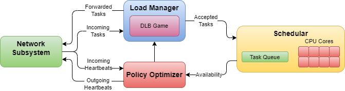
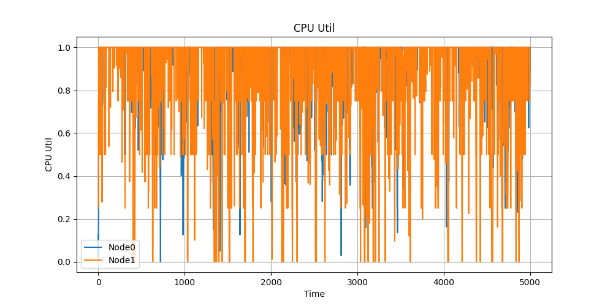
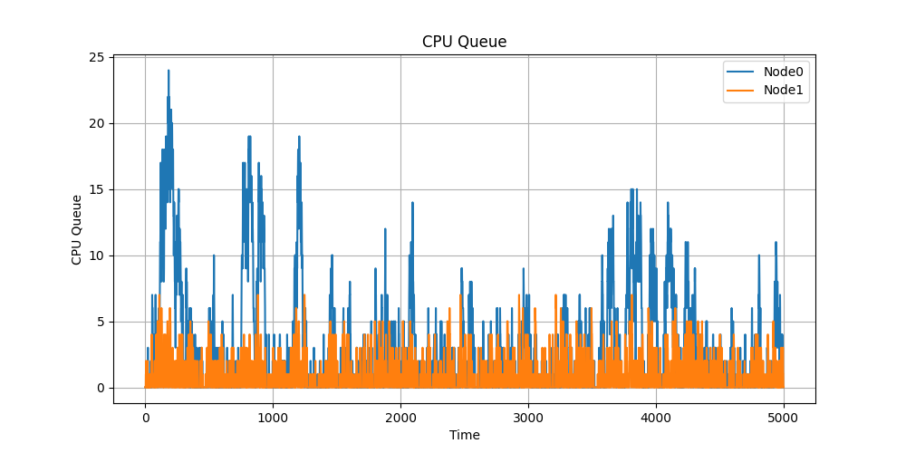
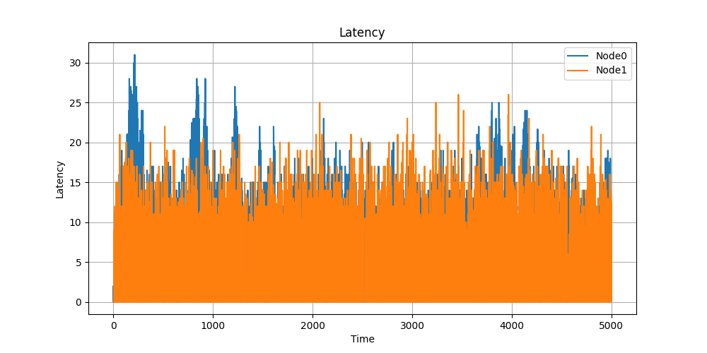

# Introduction

TODO

# Previous Work

TODO

# Methodology

The system is simulated as a set of heterogenous Malcolm Nodes connected using
simulated network links. A central loadbalancer evenly distributes incoming tasks
to the Malcolm Nodes. The core component of the simulation is a Distributed
Load-Balancing game (DLB) in the Load Manager of each Malcolm Node.

Simulation occurs in short *time slices* to allow sequential simulation of the
nodes to behave as if concurrently executed. The time slice interval is
configurable, but all tests preformed herein used a one millisecond time slice.
Smaller time slices lead to more accurate modelling of the concurrent system at
the expense of simulation runtime.

## Tasks

The purpose of the Malcolm Cluster is to evenly distribute tasks among the Malcolm
Nodes. The simulated tasks are rather simple in design with the following
parameters: CPU runtime, IO runtime, and payload size in bytes. The only system
allowed to use these parameters is the Malcolm Node Intra-node Scheduler. All
other systems treat tasks as a homogeneous black-box.

The Random Task Generator is responsible for generating random tasks to be sent
to the Malcolm Cluster. Each time slice, a random rate is chosen that determines
the number of tasks generated during this time slice. All tasks are given random
values for their parameters.

All random distributions used for task generation are configurable. Currently,
two distributions are supported: constant and gaussian/normal. The constant
distribution always assigns the configured value to the parameter. Gaussian uses
a gaussian distribution with configurable center and standard deviation to
generate values. Negative values will always we clamped to 0. It is the
responsibility of the experimenter to choose distributions that include
acceptably low probabilities of generating negative values. Future work could
extend the supported random distributions to be more diverse and complex.

## Malcolm Node

The architecture of a Malcolm Node is shown in Figure 1. There are four primary
subsystems: the Network Subsystem, Load Manager, Policy Optimizer, and Intra-node
Scheduler. The details and interactions of these subsystems iterated in the
sections hereafter.

\vspace{1em}

 \
**Figure 1.** Malcolm node architecture

### Malcolm Node: Network Subsystem

Each Malcolm Node contains a Network Subsystem responsible for receiving task
packets from the Central Loadbalancer and sending and receiving task packets and
heartbeat packets to/from other Malcolm Nodes. Bandwidth limiting, packet
overhead, and latency are controlled by the sender. Receivers have no bandwidth
limit, overhead, or latency.

### Malcolm Node: Load Manager

TODO

### Malcolm Node: Policy Optimizer

TODO

### Malcolm Node: Intra-node Scheduler

The intra-node scheduler is responsible for scheduling and simulating execution
of tasks on the simulated CPU and IO cores of this Malcolm node. Tasks are
received from the Load Manager and placed in a CPU queue. The scheduler
of each Malcolm Node is configured with the CPU core count, CPU performance,
IO core count, IO performance, and scheduler overhead.

During simulation of each time slice, tasks are take from the CPU queue and
scheduled on CPU cores. When a task is first scheduled on a CPU core, the
configured overhead of this Malcolm Node Scheduler is added to the CPU runtime
of the task. The overhead mechanism ensures that the scheduler realistically
accounts for the time spent on managing tasks, not just their execution. This is
important for accurately simulating performance and resource utilization of the
system.

After tasks have completed the CPU portion of their execution, they are added
to the IO queue then scheduled for simulation on an IO core. After IO execution
is the complete, the task is considered completed.

## Heartbeat

Heartbeats are sent from each Malcolm Node to all other nodes at the end of every
time slice. The heartbeat includes the sum of sizes of the Scheduler's CPU and IO
queues as well as its availability. Availability is defined as one minus the
CPU utilization times the CPU performance parameter. This effectively reports the
unutilized number of cores while also accounting for heterogenous performance
among nodes.

# Results

The simulation results provide a comprehensive overview of the performance
metrics for the Malcolm Nodes. The key metrics analyzed include CPU utilization,
CPU queue size, and task latency. These metrics were collected over the course
of the simulation, which was run with a one millisecond time slice. Statistics
of these metrics are provided in Table 1.

**Table 1.** Simulation Statistics

|               | CPU Util  | CPU Queue | Latency   |
|---------------|-----------|-----------|-----------|
| Node 0 Max    | 100 %     | 24        | 31        |
| Node 1 Max    | 100 %     | $~$ 7     | 26        |
| Node 0 Min    | $~~$ 0 %  | $~$ 0     | $~~$ -    |
| Node 1 Min    | $~~$ 0 %  | $~$ 0     | $~~$ -    |
| Node 0 Avg.   | $~$ 92.4 %| $~$ 2.89  | $~$ 7.85  |
| Node 1 Avg.   | $~$ 86.5 %| $~$ 1.00  | $~$ 4.50  |

## CPU Utilization

The CPU utilization for both nodes was monitored throughout the simulation. The
maximum CPU utilization for both Node 0 and Node 1 reached 100%, indicating that
the nodes were fully utilized at peak times. The minimum CPU utilization for
both nodes was 0%, showing periods of inactivity. On average, Node 0 had a CPU
utilization of 92.4%, while Node 1 had an average CPU utilization of 86.5%. This
shows that the workload was reasonably well balanced between the two nodes,
particularly given the 20x difference in performance.

\vspace{1em}

 \
**Figure 2.** CPU utilization

## CPU Queue Size

The CPU queue size, which represents the number of tasks waiting to be processed
by the CPU, varied throughout the simulation. Node 0 had a maximum queue size of
24 tasks, while Node 1 had a maximum queue size of 7 tasks. The minimum queue
size for both nodes was 0 tasks, indicating that there were times when the CPU
queue was empty. The average CPU queue size was 2.89 tasks for Node 0 and 1.00
task for Node 1.

\vspace{1em}

 \
**Figure 3.** CPU task queue size

## Task Latency

Task latency, measured as the time taken for a task to be processed from arrival
to completion, was another critical metric. Node 0 experienced a maximum task
latency of 31 milliseconds, while Node 1 had a maximum latency of 26 milliseconds.
The average task latency was 7.85 milliseconds for Node 0 and 4.50 milliseconds
for Node 1. These latency statistics are very good for the difference in Malcolm
Node performance and average task runtime. The Load Managers are effectively
balancing tasks between the nodes.

\vspace{1em}

 \
**Figure 4.** Task latency

# Conclusion

The simulation results highlight the performance characteristics of the Malcolm
Nodes under the given workload. Node 0 generally exhibited higher CPU utilization
and larger queue sizes compared to Node 1, which suggests that Node 0 was handling
a heavier load. Task latency was also higher for Node 0, reflecting the increased
processing demand. These insights can inform future optimizations and adjustments
to the load balancing and scheduling algorithms to improve overall system
performance.

\pagebreak

# Bibliography

TODO
